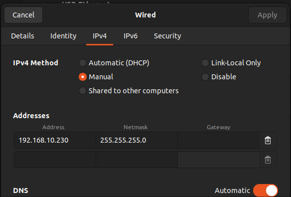
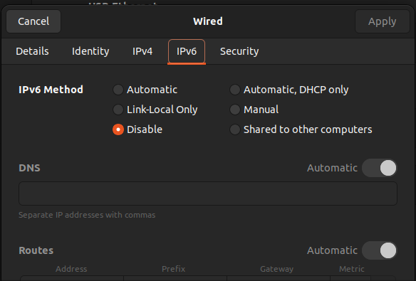

# Vicon Bridge Package

A ROS2 package for bridging Vicon motion tracking data to ROS2, converting UDP packets from Vicon systems into PoseStamped messages for real-time pose tracking.

## Table of Contents

- [Overview](#overview)
- [Features](#features)
- [Dependencies](#dependencies)
- [Network Setup](#network-setup)
  - [GUI](#network-setup)
  - [Terminal](#network-setup)
- [Installation](#installation)
- [Nodes](#nodes)
  - [vicon_bridge](#vicon_bridge)
- [Usage Examples](#usage-examples)
- [Troubleshooting](#troubleshooting)

## Overview

This package provides a bridge between Vicon motion capture systems and ROS2 robots. The `vicon_bridge` node receives UDP packets from Vicon Tracker on port 51001 and publishes pose data as ROS2 PoseStamped messages. This enables any device on the same network to access high-precision motion tracking data through standard ROS2 topics.

## Features

- Real-time motion tracking data at 100Hz
- Automatic unit conversion (mm to meters, degrees to quaternions)
- Low-latency UDP packet processing
- Error handling with throttled logging
- Compatible with standard ROS2 tf2 and geometry messages

## Dependencies

### Requirements

- ROS2 Humble ([installation instructions](https://docs.ros.org/en/humble/Installation/Ubuntu-Install-Debs.html))
- Ubuntu 22.04 LTS

### ROS2 Packages

- `rclcpp`
- `geometry_msgs`
- `tf2`
- `tf2_geometry_msgs`

## Network Setup

The device running the vicon_bridge node must be configured to communicate with the Vicon system network:

### GUI

Here are the network setting to change for the ethernet port that Vicon system is plugger into

1. In the network setting configure the ethernet  adptet IPv4 setting to be:
   
   - IPv4 Method: "Manual"
   
   - Addresses setting: 
      
      1. Address:  192.168.10.230
      
      2. Netmask: 255.255.25.0


2. Next disable IPv6:  


**Now you are ready for installation**

## Installation

1. Clone the repository:
  
  ```bash
  git clone https://vaughantd@bitbucket.org/vcuscm/vicon_bridge.git
  ```
  
2. Install dependencies:
  
  ```bash
  cd vicon_bridge/ 
  rosdep install --from-paths src --ignore-src -r -y
  ```
  
3. Build the package:
  
  ```bash
  source /opt/ros/humble/setup.bash
  colcon build --packages-select vicon_bridge
  ```
  
4. Add to ~/.bashrc for automatic sourcing and ROS domain we use for the cybercity Automonous Vehicles
  
  ```bash
  echo "source /opt/ros/humble/setup.bash" >> ~/.bashrc
  echo "source ~/ros2_ws/install/setup.bash" >> ~/.bashrc
  echo "export ROS_DOMAIN_ID=25" >> ~/.bashrc 
  ```

**Congratulates, now you are ready to run the node** 

## Usage Examples

### Running the Bridge

```bash
# Start the vicon bridge node
ros2 run vicon_bridge vicon_bridge

# Expected output:
# [INFO] [vicon_bridge]: Vicon publisher started at 100Hz
```

### Monitoring Pose Data

```bash
# Check if topic is publishing
ros2 topic hz /vicon_pose

# Echo pose data to current pose values
ros2 topic echo /vicon_pose

# View topic info
ros2 topic info /vicon_pose
``` 

## Nodes

### vicon_bridge

Receives Vicon UDP packets and publishes pose data as ROS2 messages.

#### Published Topics

- **`vicon_pose`** (`geometry_msgs/msg/PoseStamped`)
  - 6DOF pose data from Vicon system
  - Position in meters (converted from mm)
  - Orientation as quaternion (converted from Euler angles)
  - Publishing rate: 100Hz
  - Frame ID: "vicon"

#### UDP Configuration

- **Port**: 51001 (fixed, standard Vicon port)
- **Protocol**: UDP/IPv4
- **Packet Format**: Vicon binary protocol


## Troubleshooting

### No data being published

1. **Check network configuration**:
  
  ```bash
  # Verify IP address
  ip addr show | grep 192.168.10
  
  # Check IPv6 is disabled
  cat /proc/sys/net/ipv6/conf/all/disable_ipv6  # Should return 1
  ```
  
2. **Test UDP connectivity**:
  
  ```bash
  # Check if port 51001 is receiving data
  sudo tcpdump -i any -n port 51001
  
  # Or use netcat to test
  nc -ul 51001
  ```
  

### Debug logging

To enable debug messages:

```bash
ros2 run vicon_bridge vicon_bridge --ros-args --log-level debug
```